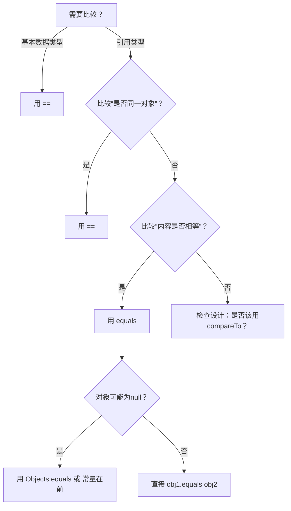

本文主要记录 Java 中 == 与 equals 的区别。

<!-- more -->

## 🔑 一句话定乾坤

- **`==`**：**比较“身份”** → 基本类型比值，引用类型比**内存地址**  
- **`equals()`**：**比较“内容”** → 默认同`==`，但**可被重写**实现逻辑相等（如String、Integer）

------

## 📊 核心区别速查表（建议截图保存！）

| 维度         | `==` 运算符                        | `equals()` 方法                                 |
| ------------ | ---------------------------------- | ----------------------------------------------- |
| **本质**     | JVM指令（`if_acmpne`/`if_icmpne`） | Object类的普通方法                              |
| **基本类型** | ✅ 比较**数值**                     | ❌ 编译错误（基本类型无方法）                    |
| **引用类型** | 比较**内存地址**（是否同一对象）   | 默认比地址，**重写后比内容**                    |
| **可重写**   | ❌ 语言级运算符                     | ✅ 子类可定制逻辑                                |
| **null安全** | ✅ `null == null` → true            | ❌ `null.equals(...)` → **NullPointerException** |
| **性能**     | ⚡ 极快（单条CPU指令）              | 🐢 较慢（方法调用+逻辑判断）                     |

------

## 🔍 深度拆解：内存视角看透本质

### 💡 场景1：基本数据类型（`==`是唯一选择）

```java
int a = 100;
int b = 100;
System.out.println(a == b); // true → 比较栈中数值

// ❌ 编译错误！基本类型不能调用方法
// System.out.println(a.equals(b)); 
```

### 💡 场景2：引用类型 - 未重写equals（默认行为）

```java
class Person {
    String name;
    Person(String name) { this.name = name; }
}

Person p1 = new Person("张三");
Person p2 = new Person("张三");
Person p3 = p1;

System.out.println(p1 == p2);      // false → 堆中两个不同对象
System.out.println(p1.equals(p2)); // false → Object.equals默认用==
System.out.println(p1 == p3);      // true  → 同一引用
```

**内存图解**：  

```
栈: p1 ──→ [堆: Person@0x100]  
栈: p2 ──→ [堆: Person@0x200]  ← 地址不同！  
栈: p3 ────────┘ (指向p1)
```

### 💡 场景3：String的“魔法”（重写equals + 常量池）

```java
String s1 = "Java";          // 常量池
String s2 = "Java";          // 复用常量池
String s3 = new String("Java"); // 堆中新建
String s4 = s3.intern();     // 手动入池

System.out.println(s1 == s2);      // true  → 常量池复用
System.out.println(s1 == s3);      // false → 堆 vs 池
System.out.println(s1.equals(s3)); // true  → 内容相同（String重写equals）
System.out.println(s1 == s4);      // true  → intern()返回池中引用
```

**String.equals源码精髓（JDK 17）**：

```java
public boolean equals(Object anObject) {
    if (this == anObject) return true; // 先用==快速判断（优化！）
    if (anObject instanceof String) {
        String aString = (String)anObject;
        return StringLatin1.equals(value, aString.value); // 逐字符比较
    }
    return false;
}
```

### 💡 场景4：Integer缓存陷阱（包装类重写equals）

```java
Integer a = 127;
Integer b = 127;
System.out.println(a == b);      // true  → 缓存池复用（-128~127）
System.out.println(a.equals(b)); // true

Integer c = 128;
Integer d = 128;
System.out.println(c == d);      // false → 超出缓存，新建对象
System.out.println(c.equals(d)); // true  → 内容比较（Integer重写equals）
```

> 📌 **关键**：`==`结果受JVM缓存机制干扰，**永远不要用==比较包装类！**

------

## ⚠️ 高频致命陷阱（附解决方案）

| 陷阱                     | 错误代码                  | 后果                    | 正确写法                                              |
| ------------------------ | ------------------------- | ----------------------- | ----------------------------------------------------- |
| **空指针爆炸**           | `str.equals("test")`      | str为null时NPE          | `"test".equals(str)` 或 `Objects.equals(str, "test")` |
| **包装类==陷阱**         | `Integer id1 == id2`      | 缓存外返回false         | `id1.equals(id2)`                                     |
| **浮点数精度坑**         | `0.1 + 0.2 == 0.3`        | false（二进制精度丢失） | `Math.abs(a-b) < 1e-6`                                |
| **重写equals忘hashCode** | 仅重写equals              | HashMap中key失效        | **必须同时重写hashCode**                              |
| **用==判字符串内容**     | `if (status == "ACTIVE")` | 偶然正确，部署后崩      | `if ("ACTIVE".equals(status))`                        |

### 💡 安全比较模板（推荐收藏）

```java
// 方案1：常量在前（避免NPE）
if ("SUCCESS".equals(response.getStatus())) { ... }

// 方案2：Java 7+ Objects工具类（最优雅）
import java.util.Objects;
if (Objects.equals(user1.getName(), user2.getName())) { ... }

// 方案3：自定义类安全比较
public boolean isEqual(User other) {
    return this == other || 
           (other != null && 
            Objects.equals(this.name, other.name) &&
            this.age == other.age);
}
```

------

## 🛠️ 重写equals的黄金法则（Effective Java准则）

### ✅ 必须满足5大特性

```java
// 自反性：x.equals(x) 必须为true
// 对称性：x.equals(y) ↔ y.equals(x)
// 传递性：x.equals(y) && y.equals(z) → x.equals(z)
// 一致性：多次调用结果不变
// 非空性：x.equals(null) 必须为false
```

### 🌰 标准重写模板（IDEA可自动生成）

```java
@Override
public boolean equals(Object o) {
    if (this == o) return true;          // 1. 自反性优化
    if (o == null || getClass() != o.getClass()) return false; // 2. 非空+类型检查
    User user = (User) o;                // 3. 安全转型
    return age == user.age && 
           Objects.equals(name, user.name); // 4. 逐字段比较
}

@Override
public int hashCode() {
    return Objects.hash(name, age); // 5. 必须重写hashCode！
}
```

> 🔥 **血泪教训**：
> 重写equals不重写hashCode → 对象放入HashMap后**永远找不到**！
> （HashMap先通过hashCode定位桶，再用equals比较）

------

## 🌍 设计哲学：为什么Java这样设计？

| 设计选择             | 深层原因                               |
| -------------------- | -------------------------------------- |
| **`==`不可重写**     | 保证“身份比较”的绝对可靠性（JVM基石）  |
| **equals默认同==**   | 遵循“最小惊讶原则”：未定制时行为明确   |
| **鼓励重写equals**   | 支持“逻辑相等”语义（业务需要）         |
| **强制hashCode联动** | 保障哈希集合的数学一致性（集合论基础） |

> 📜 **JLS（Java语言规范）明示**：
> *“If two objects are equal according to the equals method, then calling the hashCode method on each of the two objects must produce the same integer result.”*

------

## 💎 终极选择指南（决策流程图）



### 📌 一句话口诀

> **“基本类型用==，对象内容用equals，常量防空放左边，重写必带hashCode！”**

------

## 💬 互动时间

- 你是否曾因`==`和`equals`混淆导致线上事故？  
- 在Code Review中，你如何快速识别这类隐患？
    **欢迎在评论区分享你的“踩坑实录”与防御技巧！** 👇

✨ **延伸挑战**：
思考题：为什么`BigDecimal`的`equals`比较**精度**（1.0 ≠ 1.00），而`compareTo`忽略精度？这反映了什么设计思想？
（提示：金融计算场景需求）

