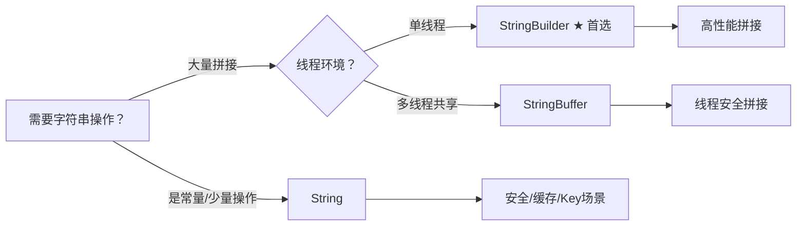

本文主要记录 Java 中 StringBuffer 与 StringBuilder、String 的区别

<!-- more -->

## 🔑 一句话灵魂总结

- **String**：**不可变**的字符串常量（安全基石）  
- **StringBuffer**：**线程安全**的可变字符串（老将）  
- **StringBuilder**：**非线程安全**的可变字符串（性能之王）  
- **核心差异**：可变性 + 线程安全 + 底层实现

------

## 📊 三剑客终极对比表（建议收藏！）

| 特性         | String                                       | StringBuffer                | StringBuilder                 |
| ------------ | -------------------------------------------- | --------------------------- | ----------------------------- |
| **可变性**   | ❌ 不可变                                     | ✅ 可变                      | ✅ 可变                        |
| **线程安全** | ✅（天然安全）                                | ✅（方法加`synchronized`）   | ❌                             |
| **性能**     | 拼接效率极低                                 | 中等（同步开销）            | ⚡ **最高**                    |
| **底层存储** | `final char[]` (Java 8) / `byte[]` (Java 9+) | `char[] value`              | `char[] value`                |
| **适用场景** | 常量、少量操作、HashMap key                  | 多线程环境拼接              | **单线程拼接首选**            |
| **JDK版本**  | 1.0                                          | 1.0                         | 1.5（为替代StringBuffer而生） |
| **继承关系** | `final class`                                | `AbstractStringBuilder`子类 | `AbstractStringBuilder`子类   |

------

## 🔒 深度解密：String为何设计为不可变？

### ✅ 源码铁证（Java 8简化版）

```java
public final class String {
    // 关键1：final类 → 无法被继承
    // 关键2：final数组 → 引用不可变
    // 关键3：无setter方法 → 内容不可修改
    private final char value[];
    
    public String substring(int beginIndex) {
        // 返回新对象！原对象不受影响
        return new String(value, beginIndex, subLen);
    }
}
```

> 💡 Java 9+优化：改用`byte[]` + `coder`字段（Latin-1/UTF-16），进一步节省内存，**但不可变性设计不变**！

### 🌟 不可变性的五大设计哲学

| 设计考量            | 详解                                           | 实际影响                                                 |
| ------------------- | ---------------------------------------------- | -------------------------------------------------------- |
| **1. 安全性**       | 网络路径、SQL语句、类加载参数等敏感场景        | 防止恶意篡改（如`"admin"`被改为`"admin/../etc/passwd"`） |
| **2. 字符串常量池** | `String s = "Java";` 多次声明指向同一内存      | 节省内存！若可变，常量池将崩溃（修改一处，所有引用全变） |
| **3. HashMap Key**  | `hashCode`被缓存（`private int hash;`）        | 作为key时哈希值永不改变，避免Map查找失效                 |
| **4. 多线程安全**   | 无状态共享对象                                 | 无需同步锁，天然线程安全                                 |
| **5. 类加载安全**   | `ClassLoader.loadClass("com.example.Service")` | 防止类名在加载过程中被篡改                               |

### 💥 不可变的“代价”与应对

```java
// 反面教材：循环内用+拼接 → 每次创建新对象！
String result = "";
for (int i = 0; i < 10000; i++) {
    result += "a"; // 创建10000个临时String对象！
}

// 正确姿势：用StringBuilder
StringBuilder sb = new StringBuilder();
for (int i = 0; i < 10000; i++) {
    sb.append("a");
}
String result = sb.toString();
```

------

## ⚙️ StringBuffer vs StringBuilder：一字之差，性能天壤之别

### 🔍 源码关键差异（JDK 17）

```java
// StringBuffer：每个方法加synchronized
@Override
public synchronized StringBuffer append(String str) {
    toStringCache = null;
    super.append(str);
    return this;
}

// StringBuilder：无同步锁
@Override
public StringBuilder append(String str) {
    super.append(str);
    return this;
}
```

### 📈 性能实测（10万次拼接，JDK 17）

```java
// 测试代码（简化版）
long start = System.nanoTime();
StringBuilder sb = new StringBuilder();
for (int i = 0; i < 100_000; i++) sb.append("a");
System.out.println("StringBuilder: " + (System.nanoTime() - start)/1e6 + "ms");

start = System.nanoTime();
StringBuffer buf = new StringBuffer();
for (int i = 0; i < 100_000; i++) buf.append("a");
System.out.println("StringBuffer: " + (System.nanoTime() - start)/1e6 + "ms");
```

**典型结果**：
`StringBuilder: 3.2ms` vs `StringBuffer: 8.7ms` → **StringBuilder快2-3倍！**
（注：多线程环境下StringBuffer优势才显现）

------

## 🎯 实战场景选择指南（附代码模板）

| 场景                        | 推荐方案            | 代码示例                                                     |
| --------------------------- | ------------------- | ------------------------------------------------------------ |
| **定义常量/配置**           | ✅ String            | `private static final String API_URL = "https://api.example.com";` |
| **单线程拼接（循环/日志）** | ✅ **StringBuilder** | `StringBuilder sb = new StringBuilder(128); // 预估容量避免扩容` |
| **多线程共享拼接**          | ✅ StringBuffer      | `private final StringBuffer logBuffer = new StringBuffer();` |
| **作为HashMap Key**         | ✅ String            | `Map<String, User> userMap = new HashMap<>();`               |
| **JSON/XML构建**            | ✅ StringBuilder     | `sb.append("{\"name\":\"").append(name).append("\"}");`      |
| **反射/类加载参数**         | ✅ String            | `Class.forName("com.example.Service");`                      |

### 💡 高级技巧：预分配容量

```java
// 避免频繁扩容（扩容=复制数组，性能杀手！）
StringBuilder sb = new StringBuilder(1024); // 预估1KB
```

------

## ❌ 高频误区避坑指南

1. **“StringBuffer已被淘汰？”**
    → 错！多线程场景仍需它（如Servlet中共享日志缓冲区）。但**90%单线程场景应选StringBuilder**。

2. **“String的+拼接会被优化？”**
    → **仅限编译期确定的常量**：
    `String s = "a" + "b";` → 编译为`"ab"`
    **循环内+拼接不会优化**！务必用StringBuilder。

3. **“用final修饰String就能防止修改？”**
    → 误解！`final String s` 仅保证引用不变，但String本身已是不可变对象。`final`在此冗余。

4. **“String不可变=绝对安全？”**
    → 反射可破解（但严重破坏设计，生产环境禁止！）：  

    ```java
    Field valueField = String.class.getDeclaredField("value");
    valueField.setAccessible(true);
    valueField.set(s, "Hacked!".toCharArray()); // ⚠️ 危险操作！
    ```

------

## 💎 总结：选择心法口诀



> **设计哲学启示**：
> 🔸 **String的不可变** = 用空间换安全与效率（常量池、哈希缓存）
> 🔸 **StringBuilder的崛起** = 为单线程场景极致优化（去同步锁）
> 🔸 **没有银弹**：理解设计初衷，方能精准选型

------

## 💬 互动时间

- 你在项目中踩过字符串拼接的坑吗？  
- 遇到过因误用StringBuffer导致的性能问题吗？
    **欢迎评论区分享实战经验！** 👇

✨ **下期预告**：《Java内存泄漏排查指南：从String常量池到ThreadLocal》
✅ **觉得干货？点赞收藏+关注，技术成长不迷路！**
