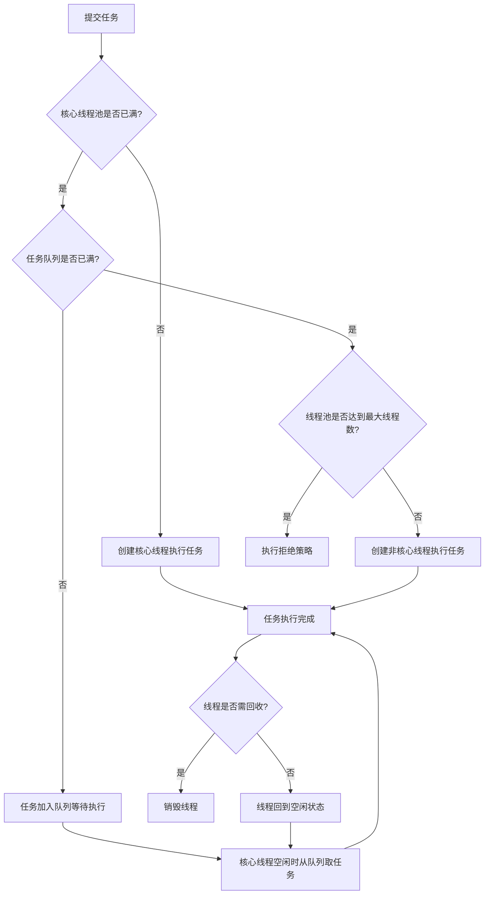
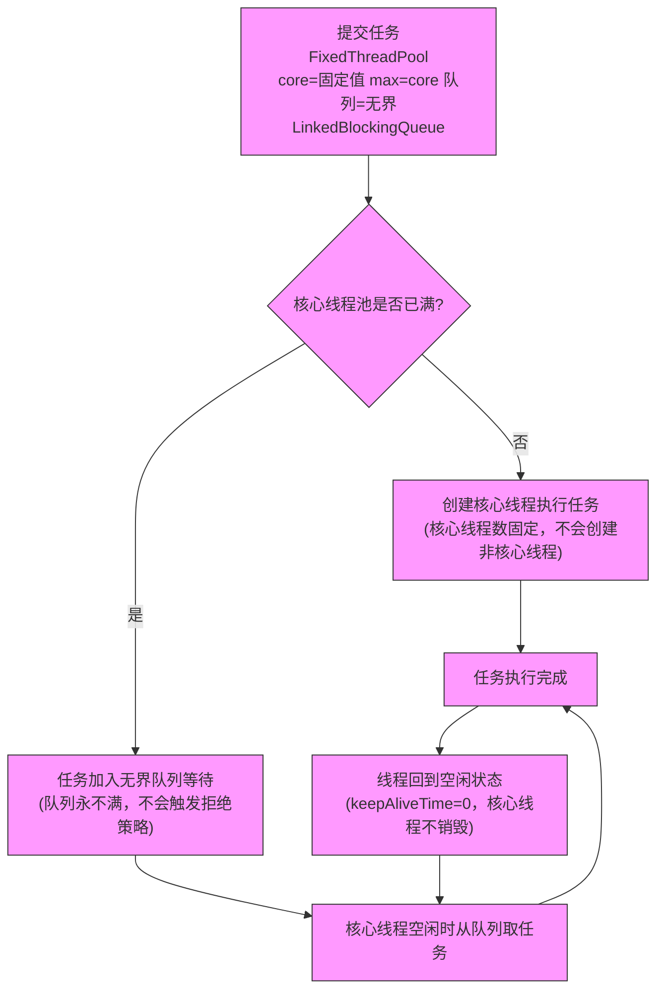
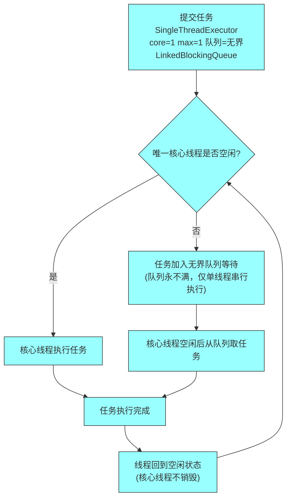
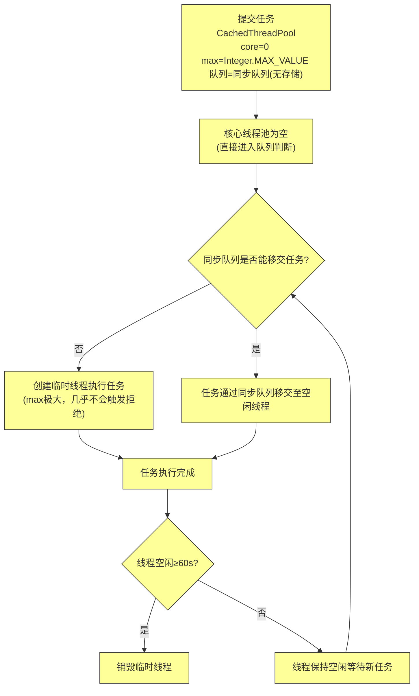

本文主要记录 Java 中线程池的创建。

<!-- more -->

## 不推荐 Executors 创建线程池的原因

Executoes 返回线程池对象的弊端如下：

+ **FixedThreadPool** 和 **SingleThreadExecutor**：允许请求的队列长度为 `Integer.MAX_VALUE`，可能堆积大量的请求，从而导致 OOM（内存溢出）。
+ **CachedThreadPool** 和 **ScheduledThreadPool**：允许创建的线程数量为 `Integer.MAX_VALUE`，可能会创建大量线程，从而导致 OOM。

## 线程池的创建

创建线程池的方式有两种，一种是通过 ThreadPoolExecutor 构造方法创建，另外一种是通过 Executor 框架的工具类 Executors 来实现。

三种类型 ThreadPoolExecutor：

+ **FixedThreadPool**：该方返回一个固定线程数量的线程池。该线程池中的线程数量始终不变。当有一个新的任务提交时，线程池中若有空闲线程，则立即执行。若没有，则新的任务会被暂存在一个任务队列中，待有线程空闲时，便处理在任务队列中的任务。
+ **SingleThreadExecutor**：方法返回一个只有一个线程的线程池。若多余一个任务被提交到该线程池，任务会保存在一个任务队列中，待线程空闲，按先入先出的顺序执行队列中的任务。
+ **CachedThreadPool**：该方法返回一个可根据实际情况调整线程数量的线程池。线程池的线程数量不确定，但若有空闲线程可以复用，则会优先使用可复用线程。若所有线程均在工作，又有新的任务提交，则会创建新的线程处理任务。所有线程在当前任务执行完毕后，将返回线程池进行复用。

通用逻辑：



**FixedThreadPool**：



**SingleThreadExecutor**:



**CachedThreadPool**：



+ **FixedThreadPool**：固定核心线程数，无界队列，线程不回收，适合任务量稳定的场景；

+ **SingleThreadExecutor**：单线程串行执行，无界队列，适合需顺序执行任务的场景；

+ **CachedThreadPool**：无核心线程，按需创建临时线程，60s 空闲销毁，适合短任务、突发高并发场景。

### ThreadPoolExecutor 类分析

构造参数：

```java
public ThreadPoolExecutor(int corePoolSize,
                          int maximumPoolSize,
                          long keepAliveTime,
                          TimeUnit unit,
                          BlockingQueue<Runnable> workQueue,
                          ThreadFactory threadFactory,
                          RejectedExecutionHandler handler)
```

+ **corePoolSize:** 核心线程数，线程数定义了最小可以同时允许的线程数量
+ **maximumPoolSize:** 当队列中存放的任务达到队列容量的时候，当前可以同时允许的线程数量变为最大线程数。
+ **workQueue:** 当新任务来的时候会先判断当前运行的线程数量是否达到核心线程数，如果达到的话，新任务就会被存放在队列中。
+ **keepAliveTime:** 当线程池中的线程数量大于 **corePoolSize** 的时候，如果这时没有新的任务提交，核心线程外的线程不会立即销毁，而是会等待，直到等待的时间超过了 keepAliveTime 才会被回收销毁。
+ **unit:** keepAliveTime 的时间单位
+ **threadFactory:** executor 创建新线程的时候会用到。
+ **handler:** 饱和策略

### 饱和策略的核心定义

ThreadPoolExecutor 的饱和策略（RejectedExecutionHandler）是线程池的 “最后一道防线”：当提交的任务满足以下两个条件时，就会触发该策略：

1. 任务队列已经满了（无法再加入新任务）；
2. 线程池中的线程数已达到`maximumPoolSize`（无法再创建新线程执行任务）。

其核心作用是**决定如何处理这个 “无法被执行” 的新任务**，JDK 内置了 4 种标准策略，也支持自定义。

所有内置策略都实现了`RejectedExecutionHandler`接口，可通过 ThreadPoolExecutor 的构造方法或`setRejectedExecutionHandler()`方法指定，默认是`AbortPolicy`。

| 策略名称                | 核心逻辑                                                     | 适用场景                                                     | 注意事项                                                     |
| ----------------------- | ------------------------------------------------------------ | ------------------------------------------------------------ | ------------------------------------------------------------ |
| **AbortPolicy（默认）** | 直接抛出`RejectedExecutionException`异常，拒绝任务提交       | 对任务执行可靠性要求高的场景（如金融交易），希望快速感知任务提交失败 | 异常会中断调用方的流程，需手动捕获处理                       |
| **CallerRunsPolicy**    | 由**提交任务的线程**自己执行这个任务（线程池不处理）         | 并发量不高、允许任务执行效率降低的场景（如普通后台任务），可“减缓”任务提交速度，避免任务丢失 | 若提交线程是主线程，可能阻塞主线程；高并发下会导致提交线程负载过高 |
| **DiscardPolicy**       | 静默丢弃这个任务，既不执行也不抛异常，无任何提示             | 对任务丢失不敏感的场景（如日志收集、非核心监控数据上报）     | 任务丢失无感知，排查问题困难                                 |
| **DiscardOldestPolicy** | 丢弃任务队列中**最旧的一个任务**（队列头部的任务），然后尝试重新提交当前任务 | 希望优先执行最新任务的场景（如实时数据处理）                 | 可能丢弃重要的旧任务，且若队列一直满，会持续丢弃旧任务       |

#### 代码示例：指定饱和策略

```java
import java.util.concurrent.*;

public class ThreadPoolRejectDemo {
    public static void main(String[] args) {
        // 核心线程数=1，最大线程数=1，队列容量=1（容易触发饱和策略）
        ThreadPoolExecutor executor = new ThreadPoolExecutor(
                1, 1,
                0L, TimeUnit.MILLISECONDS,
                new ArrayBlockingQueue<>(1), // 有界队列，容量1
                new ThreadPoolExecutor.CallerRunsPolicy() // 指定饱和策略为CallerRunsPolicy
        );

        // 提交3个任务，触发饱和策略（核心线程1个，队列1个，第3个触发）
        for (int i = 0; i < 3; i++) {
            int taskId = i;
            executor.submit(() -> {
                try {
                    Thread.sleep(1000);
                    System.out.println("任务" + taskId + "执行，执行线程：" + Thread.currentThread().getName());
                } catch (InterruptedException e) {
                    Thread.currentThread().interrupt();
                }
            });
        }
        executor.shutdown();
    }
}
```

**执行结果说明**：

- 任务0：由线程池的核心线程（pool-1-thread-1）执行；
- 任务1：加入队列等待；
- 任务2：触发CallerRunsPolicy，由提交任务的主线程（main）执行。

### 自定义饱和策略

如果内置策略不满足需求，可实现`RejectedExecutionHandler`接口自定义逻辑，比如：记录日志、任务持久化到数据库、重试提交等。

#### 代码示例：自定义饱和策略（记录日志+重试）

```java
import java.util.concurrent.RejectedExecutionHandler;
import java.util.concurrent.ThreadPoolExecutor;
import java.util.logging.Logger;

// 自定义饱和策略：记录日志 + 尝试重试提交
class CustomRejectPolicy implements RejectedExecutionHandler {
    private static final Logger logger = Logger.getLogger(CustomRejectPolicy.class.getName());
    private int retryTimes = 3; // 重试次数
    private long retryInterval = 100; // 重试间隔（毫秒）

    @Override
    public void rejectedExecution(Runnable r, ThreadPoolExecutor executor) {
        int count = 0;
        // 未关闭线程池且未重试完，就尝试重新提交
        while (!executor.isShutdown() && count < retryTimes) {
            try {
                logger.info("任务提交失败，重试第" + (count + 1) + "次");
                // 尝试将任务重新加入线程池
                executor.execute(r);
                return; // 重试成功，退出
            } catch (RejectedExecutionException e) {
                count++;
                try {
                    Thread.sleep(retryInterval);
                } catch (InterruptedException ie) {
                    Thread.currentThread().interrupt();
                    break;
                }
            }
        }
        // 重试失败，记录错误日志
        logger.severe("任务重试" + retryTimes + "次仍失败，任务被丢弃：" + r.toString());
    }
}

// 使用自定义策略
public class CustomRejectDemo {
    public static void main(String[] args) {
        ThreadPoolExecutor executor = new ThreadPoolExecutor(
                1, 1,
                0L, TimeUnit.MILLISECONDS,
                new ArrayBlockingQueue<>(1),
                new CustomRejectPolicy() // 自定义策略
        );

        // 提交3个任务触发重试
        for (int i = 0; i < 3; i++) {
            int taskId = i;
            executor.execute(() -> {
                try {
                    Thread.sleep(1000);
                    System.out.println("任务" + taskId + "执行");
                } catch (InterruptedException e) {
                    Thread.currentThread().interrupt();
                }
            });
        }
        executor.shutdown();
    }
}
```

### 关键注意事项

1. **无界队列不会触发饱和策略**：比如 **FixedThreadPool/SingleThreadExecutor** 使用的 `LinkedBlockingQueue`（默认无界），队列永远不会满，因此永远不会触发饱和策略，但可能导致内存溢出（OOM）；
2. **饱和策略仅针对 execute() 方法**：`submit()` 方法底层调用 `execute()`，但会捕获异常并封装到 Future 中，需通过 `get()` 方法才能获取到 RejectedExecutionException；
3. **选择策略的核心原则**：优先保证任务不丢失（如 CallerRunsPolicy/自定义重试），还是优先保证系统稳定（如 AbortPolicy），需结合业务场景判断。

## 一个简单线程池Demo：Runnable+ThreadPoolExecutor

MyRunner：

```java
package thread.learn.executor;

import java.util.Date;

public class MyRunner implements Runnable {

    private String command;

    public MyRunner(String command) {
        this.command = command;
    }

    @Override
    public void run() {
        System.out.println(Thread.currentThread().getName() + " Start. Time = " + new Date());
        processCommand();
        System.out.println(Thread.currentThread().getName() + " End. Time = " + new Date());
    }

    private void processCommand() {
        try {
            Thread.sleep(5000);
        } catch (InterruptedException e) {
            e.printStackTrace();
        }
    }

    @Override
    public String toString() {
        return this.command;
    }
}
```

ThreadPoolExecutorDemo:

```java
package thread.learn.executor;

import java.util.concurrent.ArrayBlockingQueue;
import java.util.concurrent.ThreadPoolExecutor;
import java.util.concurrent.TimeUnit;

public class ThreadPoolExecutorDemo {

    private static final int CORE_POOL_SIZE = 5;
    private static final int MAX_POOL_SIZE = 10;
    private static final int QUEUE_CAPACITY = 100;
    private static final long KEEP_ALIVE_TIME = 1L;

    public static void main(String[] args) {
        ThreadPoolExecutor executor = new ThreadPoolExecutor(CORE_POOL_SIZE, MAX_POOL_SIZE, KEEP_ALIVE_TIME, TimeUnit.SECONDS, new ArrayBlockingQueue<>(QUEUE_CAPACITY), new ThreadPoolExecutor.CallerRunsPolicy());
        for (int i = 0; i < 10; i++) {
            MyRunner worker = new MyRunner("" + i);
            executor.execute(worker);
        }
        executor.shutdown();
        while (!executor.isTerminated()) {
            // Wait for all tasks to complete
        }
        System.out.println("Finished all threads");
    }

}

```

执行结果：

```shell
pool-1-thread-3 Start. Time = Wed Jan 07 21:40:06 CST 2026
pool-1-thread-4 Start. Time = Wed Jan 07 21:40:06 CST 2026
pool-1-thread-5 Start. Time = Wed Jan 07 21:40:06 CST 2026
pool-1-thread-1 Start. Time = Wed Jan 07 21:40:06 CST 2026
pool-1-thread-2 Start. Time = Wed Jan 07 21:40:06 CST 2026
pool-1-thread-3 End. Time = Wed Jan 07 21:40:11 CST 2026
pool-1-thread-4 End. Time = Wed Jan 07 21:40:11 CST 2026  
pool-1-thread-2 End. Time = Wed Jan 07 21:40:11 CST 2026  
pool-1-thread-5 End. Time = Wed Jan 07 21:40:11 CST 2026  
pool-1-thread-1 End. Time = Wed Jan 07 21:40:11 CST 2026  
pool-1-thread-3 Start. Time = Wed Jan 07 21:40:11 CST 2026
pool-1-thread-4 Start. Time = Wed Jan 07 21:40:11 CST 2026
pool-1-thread-2 Start. Time = Wed Jan 07 21:40:11 CST 2026
pool-1-thread-5 Start. Time = Wed Jan 07 21:40:11 CST 2026
pool-1-thread-1 Start. Time = Wed Jan 07 21:40:11 CST 2026
pool-1-thread-2 End. Time = Wed Jan 07 21:40:16 CST 2026
pool-1-thread-3 End. Time = Wed Jan 07 21:40:16 CST 2026
pool-1-thread-4 End. Time = Wed Jan 07 21:40:16 CST 2026
pool-1-thread-5 End. Time = Wed Jan 07 21:40:16 CST 2026
pool-1-thread-1 End. Time = Wed Jan 07 21:40:16 CST 2026
```

