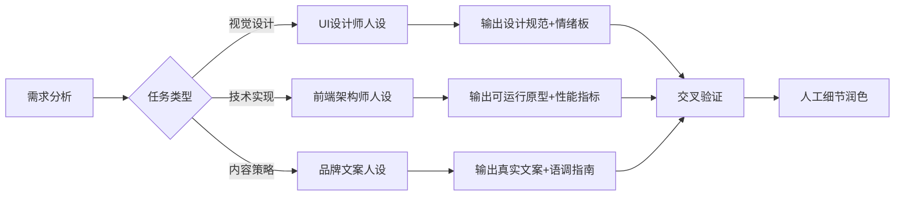
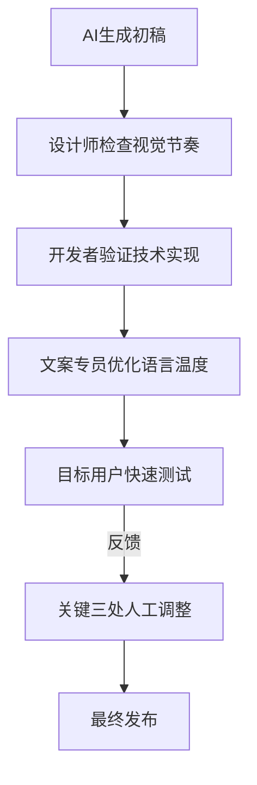

本文主要记录网站去 AI 味的一个终极指南（2026全面优化版）

<!-- more -->

> **核心理念**：真正专业的网站 = **精准人设 × 合理约束 × 细节打磨**
> 本指南融合前端工程、UI/UX设计、内容策略三重视角，助你打造"人类感十足"的网站体验

------

## 🧩 一、基础方法论体系

### 1.1 真实网站参考系统（超越截图）

```prompt
请访问 [真实网站URL]，分析其：
1. 色彩系统：主色/辅助色/中性色比例，深色模式策略
2. 排版层级：标题/正文/注释的字号/行高/字重组合
3. 空间韵律：容器内边距、元素间距的数学关系（如8px基准）
4. 交互动效：悬停/点击/过渡的缓动函数与持续时间
5. 内容密度：信息区块的呼吸感与聚焦点设计
※ 优先选择行业标杆站（如Stripe、Linear、Ant Design）而非模板站
```

### 1.2 开发流程重构（防AI味前置）

| 阶段         | 标准流程 | 去AI味强化点                                           |
| ------------ | -------- | ------------------------------------------------------ |
| **需求分析** | 功能列表 | 注入品牌人格（"这个按钮应传递专业但不失亲和力"）       |
| **原型设计** | 线框图   | 添加"破坏性细节"：不规则留白、非对称平衡、意外色彩点缀 |
| **前端开发** | 组件实现 | 强制"设计-开发走查"：验证微交互是否符合物理直觉        |
| **内容填充** | 占位文本 | 使用真实业务文案，避免"Lorem ipsum"的机械感            |

### 1.3 资源真实性增强

**图片策略**：

- 直接指令：`去Unsplash搜索"authentic workplace diversity"，筛选含自然光影/不完美构图的照片`
- 勿用：过度修饰的3D插图、纯色背景产品照、标准微笑的模特图
- 优选：有故事感的工作场景、带使用痕迹的物品、非对称构图

**字体组合**：

```markdown
- 正文：系统字体栈（`-apple-system, BlinkMacSystemFont, 'Segoe UI'`）提升原生感
- 标题：单款特色字体（如**Clash Grotesk**、**Geist**）避免过度设计
- 禁忌：同时使用>3种字体、纯装饰性手写体、无字重梯度
```

------

## 🚫 二、反向提示词系统（升级版）

### 2.1 基础必加项（所有项目适用）

```prompt
严格禁止：内联样式、表格布局、<font>标签、固定px宽度(响应式场景)、缺失alt文本、对比度<4.5:1(文字)、自动播放媒体、console.log残留、硬编码密钥
```

### 2.2 场景化反向词库

| 项目类型       | 专属反向提示词                                               | 验证方式                             |
| -------------- | ------------------------------------------------------------ | ------------------------------------ |
| **企业官网**   | 避免首屏巨型轮播图、悬浮客服按钮遮挡内容、过度发光按钮       | 模拟50岁用户3秒内能否找到核心服务    |
| **SaaS后台**   | 避免数据表格无行斑马纹、操作按钮无状态区分、复杂筛选器堆砌   | 记录完成关键任务的点击次数           |
| **内容社区**   | 避免卡片布局完全对称、用户头像统一圆形、评论区无层级缩进     | 检查连续阅读10条内容是否产生视觉疲劳 |
| **电商产品页** | 避免SKU选择器无视觉反馈、价格区域无情感设计、商品图无使用场景 | 模拟冲动购买触发点是否自然           |

### 2.3 高级约束技巧

```prompt
# 正负强化组合
"使用CSS container queries实现真正响应式（而非简单媒体查询），同时避免：断点硬编码、vw/vh滥用、图片srcset缺失"

# 框架特需约束
"React组件必须：1. 使用useCallback/useMemo优化 2. prop-types完整 3. 副作用清理。禁止：类组件、componentWillReceiveProps、内联函数作为prop"

# 设计验证指令
"每处颜色使用需标注：1. 用途（主按钮/警告）2. 对比度数值 3. 与品牌色关系。拒绝仅凭'好看'决定的色彩"
```

------

## 🎭 三、AI人设系统（精准赋能）

### 3.1 人设构建公式

```prompt
[行业经验] + [代表作品] + [思维模式] + [表达禁忌] + [验证标准]
```

✅ 优秀案例：
`"你曾主导阿里云控制台改版，习惯用'我们通过用户热力图发现...'句式。所有方案必须通过WCAG 2.1 AA标准，禁用'应该''可能'等模糊词，每次输出附可验证的代码片段"`

### 3.2 场景化人设库

| 任务类型       | 推荐人设             | 关键能力点                                 |
| -------------- | -------------------- | ------------------------------------------ |
| **品牌官网**   | "前Apple设计顾问"    | 像素级间距控制、动效物理参数、色彩情绪映射 |
| **数据看板**   | "金融系统架构师"     | 信息密度优化、错误预防设计、关键数据降噪   |
| **营销落地页** | "DTC品牌增长黑客"    | 转化路径心理学、紧迫感营造、信任符号布局   |
| **开发者工具** | "开源项目Maintainer" | 约定优于配置、零配置最佳实践、文档即代码   |

### 3.3 人设切换工作流



------

## 🧪 四、去AI味组件系统

### 4.1 特色组件库指南

| 组件库           | 适用场景          | 去AI味关键点                                              | 集成技巧                             |
| ---------------- | ----------------- | --------------------------------------------------------- | ------------------------------------ |
| **Magic UI**     | 科技/创意类网站   | 用`animate-gradient`替代静态渐变，`border-beam`创造呼吸感 | 仅用于关键CTA按钮，避免全站滥用      |
| **DaisyUI**      | 快速原型/内部工具 | 选择`[data-theme=dracula]`等非常规主题，修改`@theme`变量  | 混合自定义CSS覆盖20%默认样式         |
| **Brutalist UI** | 艺术/独立品牌     | 保持`border-width: 3px`硬边框，文字留白不对齐             | 搭配手写字体增强人性化               |
| **Glass UI**     | 时尚/生活方式     | 限制`backdrop-filter`使用区块，添加噪点纹理               | 仅浅色模式使用，深色模式降级为半透明 |
| **Radix UI**     | 企业级应用        | 完全自定义`<Tooltip>`弹出位置，重写ARIA标签               | 与设计系统变量绑定                   |

### 4.2 微交互增强清单

1. **按钮反馈**：添加`transition: transform 0.1s` + 按压缩放(95%)
2. **滚动体验**：导航栏背景渐变出现，非简单显示/隐藏
3. **加载状态**：骨架屏使用品牌色渐变而非灰色块
4. **表单验证**：实时校验+自然语言错误提示（"密码需要包含一个表情符号😉"）
5. **意外惊喜**：404页面添加可交互彩蛋，非静态插图

------

## 🎨 五、自主设计系统

### 5.1 专业配色流程

1. **提取品牌基因**：从logo/产品/用户群体提取核心色

2. **构建色彩矩阵**：

    ```mermaid
    pie
        title 色彩比例
        "主色" : 15
        "辅助色" : 10
        "中性色" : 70
        "强调色" : 5
    ```

3. **验证工具**：

    - 对比度：[A11y Contrast Checker](https://webaim.org/resources/contrastchecker/)
    - 色觉障碍模拟：[Color Oracle](https://colororacle.org/)
    - 光环境测试：深色模式/阳光下可读性

### 5.2 排版科学

```markdown
# 黄金排版组合
- **标题**：Clash Grotesk (variable font) + 字距-50 + 行高1.1
- **正文**：Satoshi/Inter + 16px/1.6行高 + 65字符宽度
- **代码**：JetBrains Mono + 背景色#f8f9fa + 圆角4px

# 去AI味排版禁忌
- 禁止全文加粗/斜体 
- 避免纯黑(#000)文字（用#1a1a1a）
- 段落间距 > 行高（创造呼吸感）
- 引用区块添加左侧色条+斜体（非仅缩进）
```

### 5.3 空间系统

| 元素类型   | 内边距    | 外边距 | 浮动阴影                    |
| ---------- | --------- | ------ | --------------------------- |
| **卡片**   | 24px      | 16px   | 0 4px 12px rgba(0,0,0,0.08) |
| **按钮**   | 12px 24px | 8px    | 0 2px 4px rgba(0,0,0,0.1)   |
| **导航**   | 16px      | 0      | 0 2px 8px rgba(0,0,0,0.05)  |
| **模态框** | 32px      | 24px   | 0 8px 32px rgba(0,0,0,0.15) |

> 💡 **空间心法**：相邻元素间距 = 二者内边距最小值，创造视觉韵律

------

## 🔍 六、AI味检测与修复

### 6.1 自查清单（发布前必检）

-  **内容维度**：文案是否含行业术语/幽默/个性？还是通用空洞描述？
-  **视觉维度**：是否存在完全对称布局？所有圆角是否相同？
-  **交互维度**：核心路径是否有意外惊喜？还是机械流程？
-  **技术维度**：Lighthouse评分>90？无控制台错误？
-  **情感维度**：截屏发给朋友，能否猜出这是什么品牌？

### 6.2 人工润色技巧

1. **不完美美学**：手动调整3个元素的微小偏移（2-3px）
2. **故事注入**：在页脚添加真实团队照片+手写签名
3. **动态细节**：日期显示"2026年2月4日 星期三"而非ISO格式
4. **声音设计**：关键操作添加微妙声音反馈（需用户授权）
5. **物理隐喻**：滚动视差效果模拟纸张厚度，非简单位移

### 6.3 专家验证流程



------

## 🚀 七、实战案例库

### 7.1 企业官网改造

**AI味特征**：居中logo+导航、全屏英雄图、三列服务卡片、底部联系表单
**去AI味方案**：

- 导航栏左侧固定logo，右侧导航项按使用频率排序
- 首屏视频背景（非图片）带可关闭字幕
- 服务展示采用不对称卡片，主服务放大且偏移
- 联系表单前置业务问题选择器，减少用户决策成本

### 7.2 后台管理系统

**AI味特征**：左侧固定菜单、顶部面包屑、表格数据居中对齐、统一按钮样式
**去AI味方案**：

- 动态菜单：根据角色权限折叠/展开
- 数据表格：
    - 金额列右对齐+货币符号
    - 状态标签使用色彩+图标双重编码
    - 操作列固定宽度，避免内容过长挤压
- 智能空状态：无数据时显示创建引导+相关教程缩略图

------

## 📌 附录：效率工具箱

### 设计资源

- **配色**：[Coolors Pro](https://coolors.co/pro)（生成情绪化配色）
- **排版**：[Typescale](https://www.typescale.com/)（科学字号系统）
- **素材**：[Human UI](https://www.humanui.com/)（非AI生成的真实界面素材）
- **动效**：[Animista](https://animista.net/)（可调参CSS动画库）

### 开发工具

- **代码质量**：ESLint规则集`eslint-config-anti-ai`
- **可访问性**：[axe DevTools](https://www.deque.com/axe/devtools/)
- **性能监控**：Lighthouse CI + 自定义阈值检查
- **设计校验**：[CSS Stats](https://cssstats.com/)（检测过度使用的属性）

### 人工复核清单

```markdown
- [ ] 在手机/平板/桌面三端检查布局断裂
- [ ] 关闭CSS查看内容逻辑是否合理
- [ ] 用屏幕阅读器测试关键流程
- [ ] 模拟网络延迟（3G）测试加载体验
- [ ] 打印页面检查关键信息是否保留
```

> ✨ **终极心法**：**最好的去AI味，是注入人类特质**
> 每次交付前问：这个设计是否体现了：  
>
> 1. **专业性**（领域知识深度）  
> 2. **个性**（品牌独特性格）  
> 3. **同理心**（用户真实场景）  
> 4. **不完美**（人性化细节）

*本指南持续更新于2026年2月，欢迎提交PR完善案例库* 💫